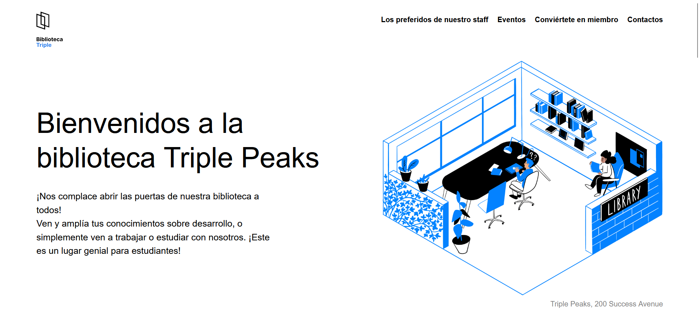

# Web Project Library

## Descripción del Proyecto

**Web Project Library** es una página web diseñada para una biblioteca ficticia, demostrando habilidades en **HTML**, **CSS**. El sitio web ofrece una experiencia interactiva y visualmente agradable, con las siguientes secciones clave:

- **Catálogo de Libros**: Muestra una lista de libros disponibles con descripciones y detalles.
- **Acerca de la Biblioteca**: Información sobre la misión, visión y la historia de la biblioteca.

El objetivo de este proyecto es ofrecer una experiencia intuitiva y moderna que refleje el entorno de una biblioteca contemporánea.

## Tecnologías Utilizadas

- **HTML5**: Para la estructura semántica del sitio.
- **CSS3**: Para el diseño responsivo y atractivo.

## Planes de Mejora

Se han identificado varias áreas para futuras mejoras:

1. **Sistema de Reservas**: Permitir a los usuarios reservar libros en línea.
2. **Recomendaciones Personalizadas**: Implementar un sistema de recomendaciones de libros basado en las preferencias del usuario.
3. **Optimización para Móviles**: Mejorar aún más la experiencia en dispositivos móviles para asegurar una navegación fluida.

Estas mejoras enriquecerán la experiencia del usuario y aumentarán la funcionalidad del sitio.

## Demo del Proyecto

Puedes ver el proyecto en acción visitando este enlace: [Web Project Library](https://zinderellasnuff.github.io/web_project_library/)

---

¡Gracias por revisar mi proyecto! Estoy abierto a sugerencias para seguir mejorando mis habilidades como desarrollador web.
